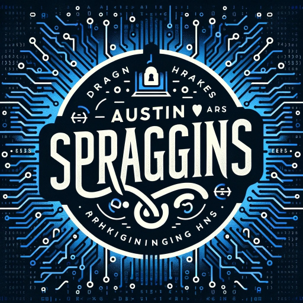

# My Web Development Portfolio
👋 Hello, I'm Austin Spraggins! Welcome to my React-based portfolio webpage, where technology meets creativity.

<!-- PROJECT LOGO -->

***

<!-- Badges -->

# Created With

| Created With   | Coresponding Badges                                          |
| -------------- | ------------------------------------------------------------ |
| HTML5          |  |
| CSS3           |  |
| JavaScript     |  |
| React          |  |
| Redux          |  |
| NodeJS         |  |
| Adobe Software |  |
| GitHub Pages   |  |
| VS Code        | 

***

**Portfolio Purpose Statement: Elevating My Web Development Journey**

In crafting this React web app portfolio, powered by the GitHub REST API, I am driven by a sincere desire to showcase the evolution of my skills and experience in web development. As a seasoned professional with a background as a web development instructor at Bitwise Industries in 2023, my commitment to growth and excellence propels me forward.

This dynamic portfolio encapsulates my journey from a truck driver to a skilled programmer, now equipped with an Associate Degree in Web Development and a fervent pursuit of a Bachelor's in Computer Science. The transition from manual labor jobs to the vibrant realm of web design and development is not just a career shift; it's a story of passion, risk-taking, and continual self-recreation.

With proficiency in HTML5, CSS3, JavaScript, Node, React, Redux, APIs, and Kali Linux, each element of this portfolio reflects my dedication to staying at the forefront of industry trends. The GitHub REST API integration offers a real-time snapshot of my coding prowess, emphasizing my commitment to transparency and continuous improvement.

Having nurtured a YouTube channel with over 10,000 subscribers, I bring not just technical expertise but also a knack for content creation and community engagement. This portfolio is a gateway for potential employers to witness my journey, skills, and unwavering passion for web development.

With aspirations to secure another impactful role in web development, I invite you to explore this portfolio as a testament to my capabilities, growth mindset, and the tangible impact I can bring to your team. Thank you for considering my application, I am eager for the opportunity to contribute to and thrive within your organization.

<!-- Overview Of Project -->

This serves as my web app portfolio. I leverage the GitHub REST API, along with React, Redux, and other technologies, to craft an elegant, simple, yet impressive showcase of my skills and projects.
***

# Crafting Excellence with React, Redux, and GitHub REST API

Welcome to my web development portfolio, meticulously crafted with React, Redux, and integration with the GitHub REST API. Here's why I chose this powerful combination for my showcase:

1. **React for Dynamic User Interfaces:**
   Harnessing the power of React, I've created a portfolio that goes beyond static displays. React's component-based architecture allows for the seamless integration of dynamic user interfaces, ensuring a smooth and engaging experience for visitors.

2. **State Management Elevated with Redux:**
   To maintain a clear and efficient state management system, I've implemented Redux. This not only simplifies the handling of complex states but also provides a centralized store for seamless data flow between components. The result is a responsive and easily maintainable web app.

3. **GitHub REST API Integration:**
   Leveraging the GitHub REST API adds a dynamic layer to my portfolio. It allows real-time updates of my latest projects, contributions, and repositories directly from my GitHub profile. This integration not only showcases my coding activities but also ensures that my portfolio is always up-to-date with my latest work.

4. **Efficiency and Scalability:**
   React, Redux, and the GitHub REST API combination brings efficiency to both development and user experience. React's virtual DOM optimizes rendering, Redux streamlines state management, and the GitHub REST API ensures that the portfolio dynamically reflects my evolving skill set and project contributions.

5. **Enhanced User Interaction:**
   The utilization of React and Redux enables me to create a highly interactive and responsive user interface. Visitors can seamlessly navigate through my projects, gaining insights into my coding proficiency and the scope of my contributions.

6. **Reflecting Current Industry Practices:**
   By incorporating these technologies, I align my portfolio with current industry practices. React and Redux are widely adopted in the development community, and the GitHub REST API integration showcases an understanding of real-time data integration – a sought-after skill in modern web development.

7. **Continuous Improvement and Learning:**
   This portfolio is not just a static representation; it's a reflection of my commitment to continuous improvement. As I enhance my skills and contribute to new projects, the portfolio, through GitHub API, automatically reflects these advancements, providing visitors with an up-to-date snapshot of my capabilities.

Thank you for exploring my portfolio crafted with React, Redux, and GitHub REST API. It's not just a showcase; it's a living testament to my dedication to excellence and innovation in web development.

***

<!-- ROADMAP -->

# Roadmap

- [ ] Correct Responsive Mobile Version - Hero Image & Profile Picture not showing
- [ ] Add images to each GitHub project

<!-- CONTRIBUTING -->

***

# Contributing

Participating in the open-source community is a fantastic opportunity for learning, inspiration, and creation. Your contributions are immensely valued.

1. Fork the Project
2. Create your Feature Branch (`git checkout -b feature/AmazingFeature`)
3. Commit your Changes (`git commit -m 'Add some AmazingFeature'`)
4. Push to the Branch (`git push origin feature/AmazingFeature`)
5. Open a Pull Request

***

<!-- CONTACT -->

# Contact Me

* Austin Spraggins Email - <spragginsdesigns@gmail.com>
* YouTube Channel: [Shadow Gaming](https://www.youtube.com/c/shadowgaming99)
* LinkedIn: [Austin Spraggins LinkedIn](https://www.linkedin.com/in/spragginsdesigns/)
* Resume: [My Resume](https://drive.google.com/file/d/1Zs80xA6bpSxLpFi6PIYoAKyXceoi0FZJ/view?usp=sharing)

***

<!-- ACKNOWLEDGEMENTS -->

# Acknowledgements

* [Choose an Open Source License](https://choosealicense.com)
* [GitHub Pages](https://pages.github.com)
* [Font Awesome](https://fontawesome.com)
* [NPM](https://www.npmjs.com/)

***
